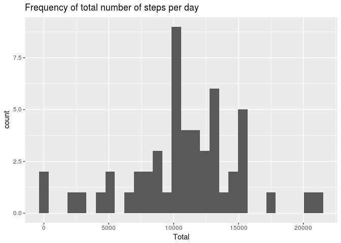
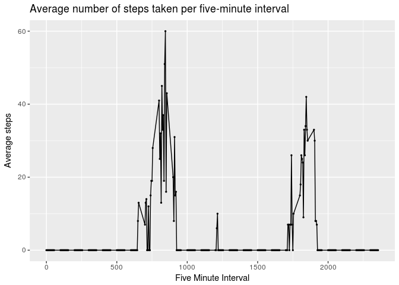
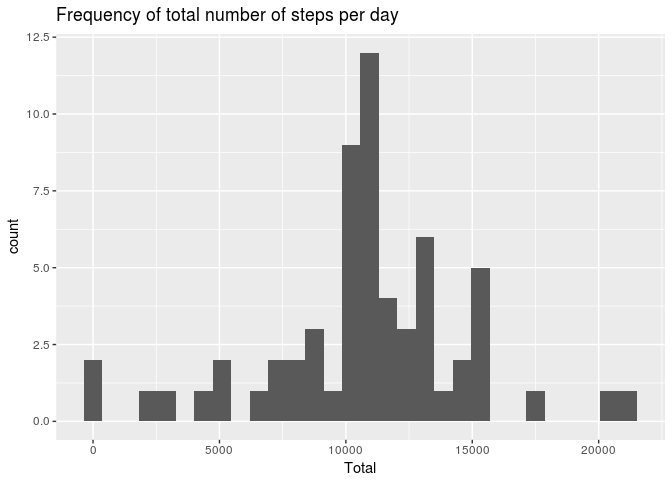
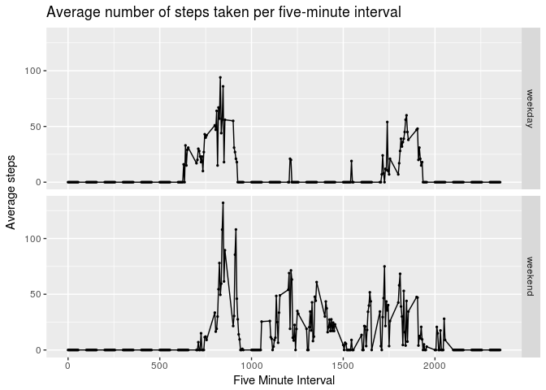

# Reproducible Research: Peer Assessment 1


## Loading and preprocessing the data

```r
library(knitr)
library(dplyr)
library(ggplot2)
library(chron)

activitydf <- read.csv("activity.csv", stringsAsFactors = F, 
                       colClasses = c("integer", "Date", "integer"))

#don't use scientific notation when displaying integers
options(scipen=999)
```


## What is mean total number of steps taken per day?

```r
#histogram of the frequency of total number of steps taken each day
activitydf %>% 
    group_by(date) %>% 
    summarise(Total = sum(steps)) %>%
    ggplot(aes(x = Total)) +
    geom_histogram(bins = 30) +
    ggtitle("Frequency of total number of steps per day")
```

```
## Warning: Removed 8 rows containing non-finite values (stat_bin).
```

<!-- -->

```r
# Mean total steps per day
mean.steps <- activitydf %>%
    group_by(date) %>% 
    summarise(Total = sum(steps)) %>%
    summarise(steps = mean(Total, na.rm = T)) %>%
    .$steps

# Median total steps per day
median.steps <- activitydf %>%
    group_by(date) %>% 
    summarise(Total = sum(steps)) %>%
    summarise(steps = median(Total, na.rm = T)) %>%
    .$steps
```

The **mean** total number of steps taken per day is 10766.19.
The **median** total number of steps taken per day is 10765.

## What is the average daily activity pattern?

```r
#Make a time series plot (i.e. type = "l") of the 5-minute interval (x-axis) and the average number of steps taken, averaged across all days (y-axis)
activitydf %>%
    group_by(interval) %>% 
    summarise(avg = median(steps, na.rm = T)) %>%
    ggplot(aes(x = interval, y = avg)) +
    geom_point(size=0.5) +
    geom_line() +
    xlab("Five Minute Interval") +
    ylab("Average steps") +
    ggtitle("Average number of steps taken per five-minute interval")
```

<!-- -->

```r
#Which 5-minute interval, on average across all the days in the dataset, contains the maximum number of steps?
max.interval <- activitydf %>%
    group_by(interval) %>% 
    summarise(avg = median(steps, na.rm = T)) %>%
    arrange(desc(avg))

max.interval <- max.interval[1,]$interval
```

The maximum number of steps is taken in the 845th interval.

## Imputing missing values

```r
# Calculate total number of missing values in the dataset
num.missing     <- sum(rowSums(is.na(activitydf)))
percent.missing <- num.missing/nrow(activitydf)*100
```


The number of rows with missing values is 2304, this is 13.11% of the total data.


```r
# Replace missing steps values in dataset
activity2 <- activitydf
#Replace NAs with the mean steps for the given interval across all days
activity2 <- activity2 %>% 
    #first group by interval
    group_by(interval) %>% 
    #then replace missing values with the mean for that interval
    mutate(steps = ifelse(is.na(steps), mean(steps, na.rm = T), steps))
    
#histogram of the total number of steps taken each day
activity2 %>% 
    group_by(date) %>% 
    summarise(Total = sum(steps)) %>%
    ggplot(aes(x = Total)) +
    geom_histogram(bins = 30) +
    ggtitle("Frequency of total number of steps per day")
```

<!-- -->

```r
# Mean total steps per day
mean.steps2 <- activity2 %>%
    group_by(date) %>% 
    summarise(Total = sum(steps)) %>%
    summarise(steps = mean(Total)) %>%
    .$steps

# Median total steps per day
median.steps2 <- activity2 %>%
    group_by(date) %>% 
    summarise(Total = sum(steps)) %>%
    summarise(steps = median(Total)) %>%
    .$steps
```

The **mean** total number of steps taken per day, with missing values removed, is 10766.19. This is a difference of 0.

The **median** total number of steps taken per day, with missing values removed, is 10766.19. This is a difference of -1.19.


## Are there differences in activity patterns between weekdays and weekends?

```r
#1. Create a new factor variable in the dataset with two levels -- "weekday" and "weekend" indicating whether a given date is a weekday or weekend day.
activity2$day <- as.factor(ifelse(is.weekend(activity2$date), 'weekend', 'weekday'))

#2. Make a panel plot containing a time series plot (i.e. `type = "l"`) of the 5-minute interval (x-axis) and the average number of steps taken, averaged across all weekday days or weekend days (y-axis). The plot should look something like the following, which was created using **simulated data**:
activity2 %>%
    group_by(day, interval) %>% 
    summarise(avg = median(steps)) %>%
    ggplot(aes(x = interval, y = avg)) +
    geom_point(size=0.5) +
    geom_line() +
    facet_grid(day~.) +
    xlab("Five Minute Interval") +
    ylab("Average steps") +
    ggtitle("Average number of steps taken per five-minute interval")
```

<!-- -->
